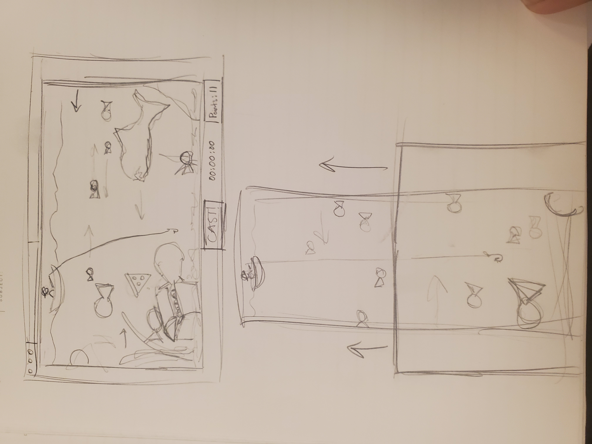
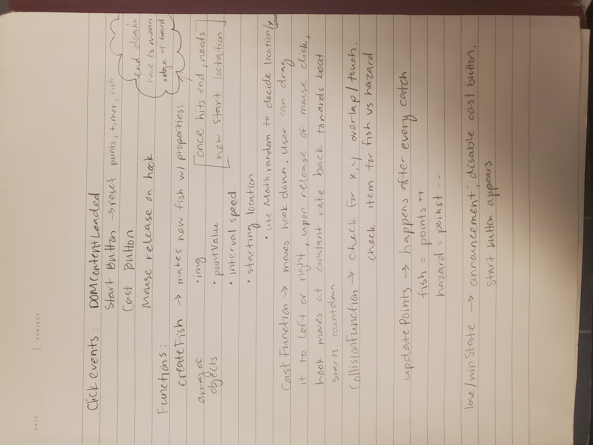
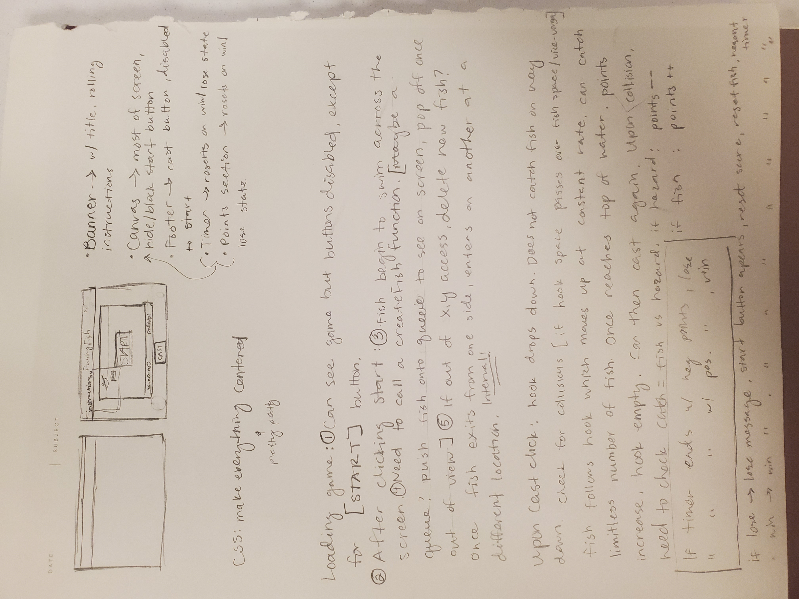

# **Project One: Fishing 'n Such**

## Planning Process
### 1. Game Description
My game will be a Go Fish/Fishing Tycoon style game where the player character is at the top of the screen in a boat with a fishing rod. Upon the start of the game, the fishing lure will drop at a specified speed towards the bottom of the screen which will be a view of an ocean scene. Fish of varying size (and other objects) will be passing across the screen at different intervals and directions, horizontally. The player will need to sweep across the screen to catch fish. There will be a point system and hazards in the game.

### 2. Game Tech
I will be using basic HTML5 Canvas, HTML 5, CSS and Javascript to implement the Funky Fish game board and game logic.

### 3. Minimal Viable Product
My MVP will be a static canvas with boxes (/'fish') moving across the screen horizontally at varying intervals. The game will have a casting button to start the fishing and the player will have to catch as many boxes/fish as the fishing pole reals back in at a specified speed, each catch with a specified number of points. If a player hits or catches a hazard (shark), the player will lose points until they lose/die from a hazard. Winning state will be some form of standard in points or timing.

## 4. STRETCH GOALZ BABEEE
### + My highest priority for SGs is to make the game visually apealling to the user. I think this important since styling is somethig I find challenging and I want to practice as much as I can.
### + Next I would like to add a moving frame over a larger canvas in a flappy bird style where the board moves rather than the player who will move only side to side.
### + If I have time I would like to make this game mobil friendly
### + If by some miracle I actually get all of that done I would want to add some fun features like more hazards (i.e. trash, clothes, odd objects that help or hinder the player).

## Final Project Outcome
### MVP: 
My MVP changed only slightly from start to finish. Rather than having a casting button, I decided to implement a mousemove event that creates a fishing line when the user moves their mouse around the canvas.

### Game play and rules:
The game begins with an instructional panel that explains how to win: when the timer hits :00, the user needs 30 points or greater to win. If the user has less than 30 points after 30 seconds, then a "game over fish"/ dead fish swims across the screen. If the user catches the large shark they lose immediately, and if they cathc the small shark, they lose ten points.

### Tools:
I implemented the game with HTML5 Canvas and collision detection assess when a user catches a fish or hazard.

### Obstacles:
I ran into a quite a few obstacles along the way, including my fishing line running off the screen in a different derection than I wanted, my fishing line shrinking into infinity, and fish that refused to swim. Some things that may have been bugs I've deems as features such as the somewhat unsmooth looping that cuases my fish to look like they are actually swimming, but I love that so I kept it in.

### Features:
I successfully implented my stretch goal of making the game visually appealing and adding art assets and some fun hazard features. I want to continue working on this game once I graduate and add my stretch goals, perhaps by enhancing my visuals and art assets and making the game mobile friendly.

### Technologies:
HTML5 Canvas, Css, and javascript

;
;
;